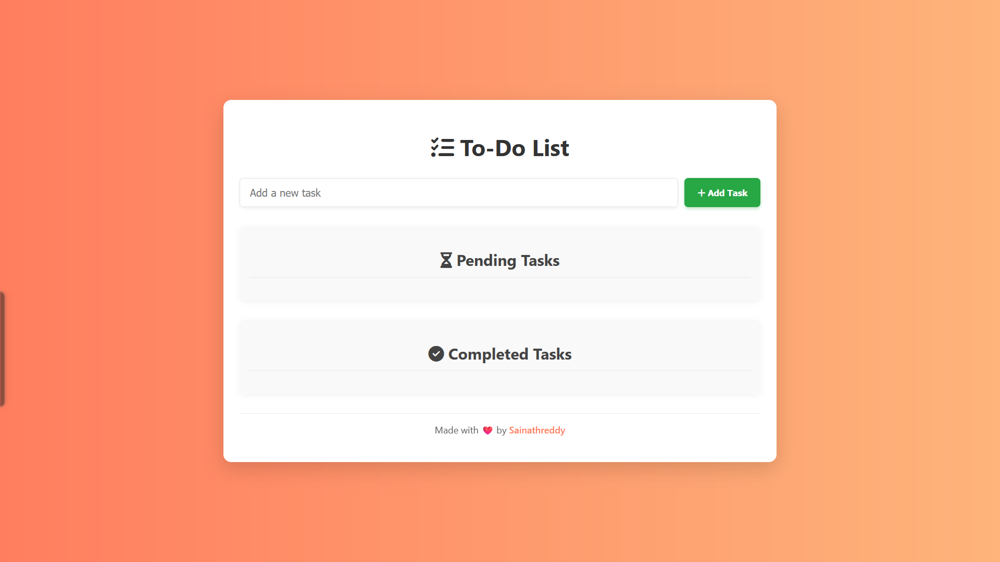

# Todo List Application

A responsive and feature-rich Todo List application built with HTML, CSS, and JavaScript.

## [View Live Demo](https://sainath-666.github.io/Todo_List_1/)

## Preview

## Features

- Add, edit, and delete tasks
- Mark tasks as completed or pending
- Responsive design that works on all devices
- Local storage to persist tasks between sessions
- Clean and modern user interface

## Technologies Used

- HTML5
- CSS3 (with Flexbox for responsive layout)
- JavaScript (ES6+)
- Local Storage API
- Font Awesome icons

## How to Use

1. Enter a task in the input field
2. Click "Add Task" or press Enter to add the task
3. Use the buttons to mark tasks as complete, edit, or delete them
4. Tasks are automatically saved to your browser's local storage

## Installation

1. Clone this repository
2. Open `index.html` in your browser
3. Start managing your tasks!

## Connect with Me

- LinkedIn: [Sainath666](https://www.linkedin.com/in/sainath666)

---

  
Made with ❤️ by Sainathreddy

